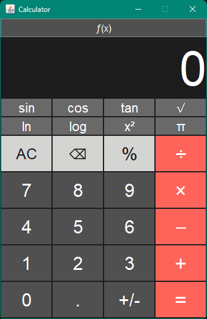

# Calculator

A simple desktop calculator built with Java Swing, styled after the classic iOS calculator. It supports basic arithmetic out of the box, with an expandable scientific mode for trigonometric, logarithmic, and other advanced functions.

## Features

- Basic arithmetic: addition, subtraction, multiplication, division
- Percentage and backspace support
- Sign toggle (positive/negative)
- Expandable scientific mode via the `ƒ(x)` toggle button, adding:
  - `sin`, `cos`, `tan`
  - `√` (square root)
  - `ln`, `log`
  - `x²`
  - `π`
- Clean, dark-themed UI inspired by the iOS calculator

## Screenshot

## Requirements

- Java Development Kit (JDK) 8 or later

## Usage

- Use the number pad and operator buttons just like a standard calculator.
- Tap `ƒ(x)` at the top to expand the window and reveal scientific functions; tap it again to collapse back to basic mode.
- Choose operations such as addition (+), subtraction (-), multiplication (×), division (÷) and more. ➗✖️➖➕
- Use `AC` to clear all input, `⌫` to delete the last digit, and `%` for percentage calculations.

## Built With

- [Java Swing](https://docs.oracle.com/javase/tutorial/uiswing/) - GUI toolkit

## Contributing

Contributions, issues, and feature requests are welcome. Feel free to open an issue or submit a pull request.

## License

This project is licensed under the MIT License - see the [LICENSE](LICENSE) file for details.
